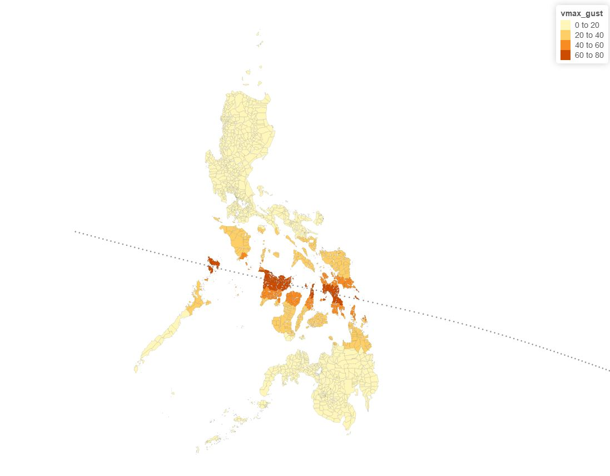

# TYPHOONTRACK2GRIDPOINT
This script is developed to translate Typhoon track data, with information on maximum wind speed and typhoon center, into wind speed at a grid point location. for the Priority indexing model this will be at the center of municipalities 
In Addtion to maximum wind speed the tool will also calculate duration of exposure to a wind speed above a certain threshold and this will be calculated for each grid location based on typhoon track data 

# typhoon Track data(For example PAGASA forecast comes with the follwoing information into gridpoint 
#BASIN,CY,YYYYMMDDHH,,,,LAT,LON,VMAX,MSLP,TY,RAD,RAD1,RAD2,RAD3,RAD4,RADP,RRP	MRD	GUSTS	EYE	SPEED	STORMNAME	DEPTH
#CP, 01, 2015072506,   , BEST,   0, 273N, 1295E,  60,  978, TS,  34, NEQ,  105,   90,   90,   95, 1009,  190,  15,   0,   0,   C,   0,    ,   0,   0,     HALOLA, M, 
#CP, 01, 2015072506,   , BEST,   0, 273N, 1295E,  60,  978, TS,  50, NEQ,   45,   40,   40,   55, 1009,  190,  15,   0,   0,   C,   0,    ,   0,   0,     HALOLA, M, 
#CP, 01, 2015072512,   , BEST,   0, 285N, 1292E,  55,  982, TS,  34, NEQ,   95,   70,   70,   85, 1009,  180,  15,   0,   0,   C,   0,    ,   0,   0,     HALOLA, M, 
#CP, 01, 2015072512,   , BEST,   0, 285N, 1292E,  55,  982, TS,  50, NEQ,   30,   25,   25,   30, 1009,  180,  15,   0,   0,   C,   0,    ,   0,   0,     HALOLA, M, 
#CP, 01, 2015072518,   , BEST,   0, 298N, 1291E,  50,  985, TS,  34, NEQ,   90,   80,   80,   70, 1006,  140,  35,   0,   0,   C,   0,    ,   0,   0,     HALOLA, M, 
#CP, 01, 2015072600,   , BEST,   0, 310N, 1292E,  45,  989, TS,  34, NEQ,   80,   70,   90,   80, 1007,  140,  35,   0,   0,   C,   0,    ,   0,   0,     HALOLA, M, 
#CP, 01, 2015072606,   , BEST,   0, 322N, 1294E,  40,  993, TS,  34, NEQ,   80,   70,   90,   80, 1007,  140,  35,   0,   0,   C,   0,    ,   0,   0,     HALOLA, M, 
#CP, 01, 2015072612,   , BEST,   0, 333N, 1300E,  20, 1007, DB,   0,    ,    0,    0,    0,    0, 1007,  130,  35,   0,   0,   C,   0,    ,   0,   0,     HALOLA, M,

for typhoon model we need data at each grid location(manucipality centers) and this coede is to calculate wind
speed at manucipality centers 
# this tool is based on the the work of "Willoughby, HE, RWR Darling, and ME Rahn. 2006. 
#“Parametric Representation of the Primary Hurricane Vortex. Part II:
#A New Family of Sectionally Continuous Profiles.” Monthly Weather Review 134 (4): 1102–20.
The result of the calculation will then looks like the follwoing 
Vmax_gust maximum wind speed
Vmax_sust maximum sustaind speed
dist_track minimum distance from typhoon track
gust_dur total duration of exposure for gust wind
sust_dur total duration of exposure for sustained wind 

Mun_code,lat,lon,vmax_gust,vmax_sust,dist_track,typoon_name2,gust_dur,sust_dur
PH012801000,18.453,120.91,20.09104,13.483918,162.246178,nock-ten,690,350
PH012802000,18.267,120.61,22.79886,15.30125,130.11633,nock-ten,690,420
PH012803000,17.906,120.5,27.39836,18.388162,88.810075,nock-ten,650,350
PH012804000,18.49,120.75,20.29049,13.617776,158.833509,nock-ten,650,390
PH012805000,18.038,120.58,25.4197,17.060203,105.755008,nock-ten,650,390
PH012806000,18.48,120.64,20.7257,13.909865,153.243187,nock-ten,650,400
PH012807000,18.219,120.86,22.35745,15.005001,136.556709,nock-ten,650,450
PH012808000,18.011,120.5,26.10713,17.521566,99.347801,nock-ten,650,450
PH012809000,18.077,120.72,24.36572,16.352832,115.823812,nock-ten,650,450
PH012810000,18.477,120.83,20.16238,13.531799,161.310408,nock-ten,650,450
PH012811000,17.967,120.65,25.9712,17.430335,101.612818,nock-ten,650,450

