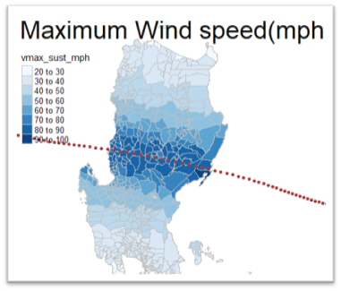
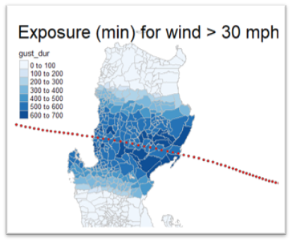

R script that uses WILLOUGHBY et al. methedology to calculate windspeed at any gridpoint location in the Phillipiness area of Responsiblity(PAR), based on a typhoon track data. The script include some codes from [stormwindmodel R package](https://CRAN.R-project.org/package=stormwindmodel). This package applies the same methedology to estimate windspeed at any grid location in the US. 

The script is available under the [GPL license](LICENSE)

# Localized windspeed 
This script is developed to calculate localized wind speed and exposure duration from a typhoon track data with information 
on maximum wind speed and typhoon center. This tool can be used to calculate wind speed at any grid point location in 
the Philippines Responsibility Area (PAR).  In Addition to maximum wind speed the tool will also calculate duration of
exposure to a wind speed above a certain threshold. 

# Typhoon Track data
Typhoon forecast data from National Met agencies come in different format, the following example shows a typhoon warning
bulletin issued by PAGASA for the Philippines responsibility area.  

The relevant information on typhoon is extracted form the text document 

The typhoon track data is not sufficient information to estimate the possible impact of typhoon. A wind severity map, 
which will show the magnitude of wind at different locations is needed as an input for impact based forecasting models. 
For 510 typhoon model we need data at each grid location (municipality centers) and this tool can be used to calculate 
wind speed at municipality centers.

In addition to typhoon track data , we need to provide information on grid locations for which we want to extract windspeed
Grid point location is provided in the following format 

 - gridid,glat,glon
 - PH012801000,18.453,120.910 
 - PH012802000,18.267,120.610 
 - PH012803000,17.906,120.500 
 - PH012804000,18.490,120.750
 - PH012805000,18.038,120.580 
 - PH012807000,18.219,120.860 
 - PH012808000,18.011,120.500 
 - PH012820000,18.146,120.590  
 - PH012901000,16.893,120.570 
 - PH012809000,18.077,120.720 
 - PH101314000,8.374,124.890 
 
where: gridid- municipality pcode, glat is latitude, glon is longitude 
with the two inputs, Track data and grid points, the code will produce output similar to the table shown below 

In the table above  
Vmax_gust maximum wind speed
Vmax_sust maximum sustaind speed
dist_track minimum distance from typhoon track
dist_track minimum distance from typhoon track
gust_dur total duration of exposure for gust wind
gust_dur total duration of exposure for gust wind above 30mph
gust_dur total duration of exposure for gust wind above 30mph

| duration of exposure for gust wind above 30mph |Distance from typhoon track and wind speed       |
| ---------------------------------------------- | --------------------------                      |
|   |   |
|    |   |

sust_dur total duration of exposure for sustained wind 

# Wind severty mapping
Then we can create a severity map from  the calculated gridpoint windspeed data

# Referances

This tool is based on the the work of "Willoughby, HE, RWR Darling, and ME Rahn. 2006. Parametric Representation of the Primary
Hurricane Vortex. Part II: A New Family of Sectionally Continuous Profiles.” Monthly Weather Review 134 (4): 1102–20.

